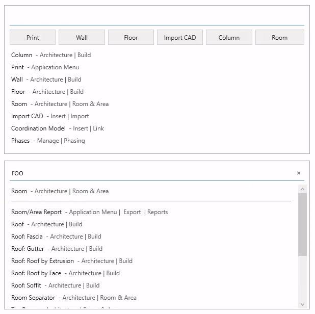
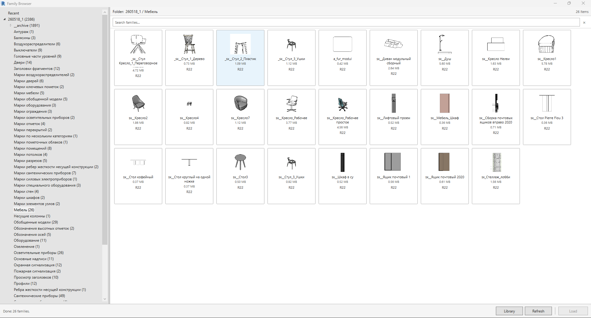
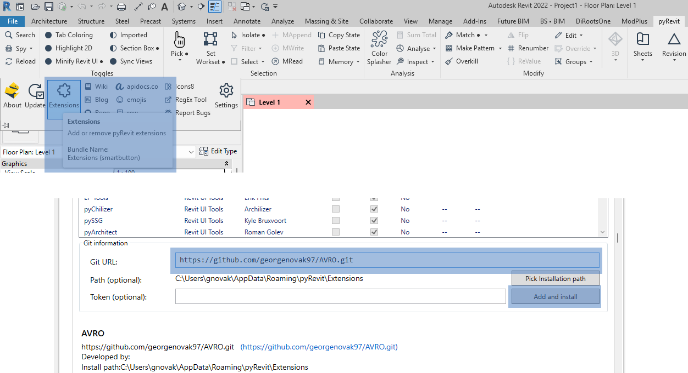

[AVRO](https://avro.pro/en/) — BIM & IT Consulting by George Novak

#### Tools

- **Search** — quickly find and run Revit commands
  
  - Left `CTL` + `Space` opens Search
  - Search Revit commands by name
  - Fast command launch directly from the keyboard
  - Most used commands list
  - Recent commands list
  - Right click in search results — remove from recent commands list
  - Command ranking based on usage history
  - Supports Revit command catalogs by version and UI language
  - Slash commands
  - Dark/light theme
	
- **Family Browser** — browse and load Revit families from your local library
  
	- Browse folders with `.rfa` files and thumbnail previews
	- Folder tree with multiple levels
	- Search by name
	- Left double-click or "Load" button — load family into project
	- Right double-click — open family location in Windows Explorer
	- Place in model with return to the browser window
	- Recent files list
	- Dark/light theme

---
#### Installation
  
1. Add `https://github.com/georgenovak97/AVRO.git` via **pyRevit → Extentions → Git URL → Add and install**.
2. In the Revit ribbon: tab **"Additional"** → panel **"Tools"** → **"Family Browser"**.

---
#### First Launch

1. Go to the **"Additional"** tab in Revit.
2. Open **"Family Browser"**.
3. Click **"Library"** and select the root folder with your families.
4. Wait for the cache to load.

---
#### Requirements

- pyRevit 4.8+
- Revit 2020+